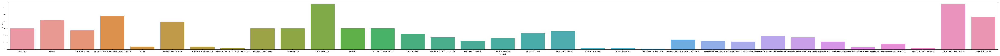

```python
# Import modules
import pandas as pd
import matplotlib.pyplot as plt
import seaborn as sns
import numpy as np

from sklearn.preprocessing import LabelBinarizer, LabelEncoder
from sklearn.metrics import confusion_matrix

from tensorflow import keras
from keras.models import Sequential
from keras.layers import Dense, Activation, Dropout
from keras.preprocessing import text, sequence
from keras import utils

xls = pd.ExcelFile('Glossary.xls')
xls.sheet_names
```

    Using TensorFlow backend.
    


    ['Glossary', 'alternative_tag', 'subject_type']


```python
df = xls.parse('Glossary')
df = df[(df['language'] == 'eng') & (df['subject_id'] != 0)]
print(df.head(5))
```

       language  subject_id                 keyword simplified_definition  \
    34      eng          20      "De facto" concept                   NaN   
    36      eng          20       "De jure" concept                   NaN   
    38      eng          20  Child dependency ratio                   NaN   
    40      eng          20        Crude birth rate                   NaN   
    42      eng          20        Crude death rate                   NaN   
    
                                        detail_definition  
    34  Under a "de facto" concept, the population inc...  
    36  Under a "de jure" concept, all persons who usu...  
    38  Child dependency ratio refers to the number of...  
    40  Crude birth rate refers to the number of live ...  
    42  Crude death rate refers to the number of death...  
    


```python
subject_df = xls.parse('subject_type')
subject_df = subject_df.set_index('subject_id')
print(subject_df.head(5))
```

                id       chi_name  \
    subject_id                      
    10           1  官方統計綜合報告及參考資料   
    20           2             人口   
    30           3             勞工   
    40           4           對外貿易   
    50           5    國民收入及國際收支平衡   
    
                                                         eng_name  
    subject_id                                                     
    10          General Reports and References in Official Sta...  
    20                                                 Population  
    30                                                     Labour  
    40                                             External Trade  
    50                    National Income and Balance of Payments  
    


```python
df['subject'] = df['subject_id'].apply(lambda x: subject_df.loc[x]['eng_name'])
print(df.head(5))
```

       language  subject_id                 keyword simplified_definition  \
    34      eng          20      "De facto" concept                   NaN   
    36      eng          20       "De jure" concept                   NaN   
    38      eng          20  Child dependency ratio                   NaN   
    40      eng          20        Crude birth rate                   NaN   
    42      eng          20        Crude death rate                   NaN   
    
                                        detail_definition     subject  
    34  Under a "de facto" concept, the population inc...  Population  
    36  Under a "de jure" concept, all persons who usu...  Population  
    38  Child dependency ratio refers to the number of...  Population  
    40  Crude birth rate refers to the number of live ...  Population  
    42  Crude death rate refers to the number of death...  Population  
    


```python
df['subject'].describe()
```


    count                711
    unique                33
    top       2016 By-census
    freq                  65
    Name: subject, dtype: object


```python
plt.rcParams['figure.figsize'] = (100.0, 5.0)
sns.countplot(df['subject'])
```


    <matplotlib.axes._subplots.AxesSubplot at 0x169a1c75320>





```python
df['keyword'].describe()
```


    count               711
    unique              342
    top       Establishment
    freq                  9
    Name: keyword, dtype: object


```python
train_def = df['detail_definition'].values[:-5]
train_key = df['keyword'].values[:-5]

# due to the lack of data, I'm just going to use data from train to test
test_def = [train_def[-5]]
test_key = [train_key[-5]]
```


```python
max_words = 1000
tokenize = text.Tokenizer(num_words=max_words, char_level=False)
```


```python
tokenize.fit_on_texts(train_def) # only fit on train
x_train = tokenize.texts_to_matrix(train_def)
x_test = tokenize.texts_to_matrix(test_def)
```


```python
# Use sklearn utility to convert label strings to numbered index
encoder = LabelEncoder()
encoder.fit(train_key)
y_train = encoder.transform(train_key)
y_test = encoder.transform(test_key)
```


```python
# Converts the labels to a one-hot representation
num_classes = np.max(y_train) + 1
y_train = utils.to_categorical(y_train, num_classes)
y_test = utils.to_categorical(y_test, num_classes)
```


```python
# Inspect the dimenstions of our training and test data (this is helpful to debug)
print('x_train shape:', x_train.shape)
print('x_test shape:', x_test.shape)
print('y_train shape:', y_train.shape)
print('y_test shape:', y_test.shape)
```

    x_train shape: (706, 1000)
    x_test shape: (1, 1000)
    y_train shape: (706, 337)
    y_test shape: (1, 337)
    


```python
# Build the model
model = Sequential()
model.add(Dense(512, input_shape=(max_words,)))
model.add(Activation('relu'))
model.add(Dropout(0.5))
model.add(Dense(num_classes))
model.add(Activation('softmax'))

model.compile(loss='categorical_crossentropy',
              optimizer='adam',
              metrics=['accuracy'])
```

    WARNING:tensorflow:From C:\Users\Toby\Anaconda3\lib\site-packages\keras\backend\tensorflow_backend.py:66: The name tf.get_default_graph is deprecated. Please use tf.compat.v1.get_default_graph instead.
    
    WARNING:tensorflow:From C:\Users\Toby\Anaconda3\lib\site-packages\keras\backend\tensorflow_backend.py:541: The name tf.placeholder is deprecated. Please use tf.compat.v1.placeholder instead.
    
    WARNING:tensorflow:From C:\Users\Toby\Anaconda3\lib\site-packages\keras\backend\tensorflow_backend.py:4432: The name tf.random_uniform is deprecated. Please use tf.random.uniform instead.
    
    WARNING:tensorflow:From C:\Users\Toby\Anaconda3\lib\site-packages\keras\backend\tensorflow_backend.py:148: The name tf.placeholder_with_default is deprecated. Please use tf.compat.v1.placeholder_with_default instead.
    
    WARNING:tensorflow:From C:\Users\Toby\Anaconda3\lib\site-packages\keras\backend\tensorflow_backend.py:3733: calling dropout (from tensorflow.python.ops.nn_ops) with keep_prob is deprecated and will be removed in a future version.
    Instructions for updating:
    Please use `rate` instead of `keep_prob`. Rate should be set to `rate = 1 - keep_prob`.
    WARNING:tensorflow:From C:\Users\Toby\Anaconda3\lib\site-packages\keras\optimizers.py:793: The name tf.train.Optimizer is deprecated. Please use tf.compat.v1.train.Optimizer instead.
    
    WARNING:tensorflow:From C:\Users\Toby\Anaconda3\lib\site-packages\keras\backend\tensorflow_backend.py:3576: The name tf.log is deprecated. Please use tf.math.log instead.
    
    


```python
model.fit(x_train, y_train,
          batch_size=10,
          epochs=10,
          verbose=1)
```

    WARNING:tensorflow:From C:\Users\Toby\Anaconda3\lib\site-packages\tensorflow\python\ops\math_grad.py:1250: add_dispatch_support.<locals>.wrapper (from tensorflow.python.ops.array_ops) is deprecated and will be removed in a future version.
    Instructions for updating:
    Use tf.where in 2.0, which has the same broadcast rule as np.where
    Epoch 1/10
    706/706 [==============================] - 1s 1ms/step - loss: 5.4007 - acc: 0.1473
    Epoch 2/10
    706/706 [==============================] - 1s 1ms/step - loss: 3.1755 - acc: 0.5467
    Epoch 3/10
    706/706 [==============================] - 1s 1ms/step - loss: 1.6120 - acc: 0.7337
    Epoch 4/10
    706/706 [==============================] - 1s 1ms/step - loss: 0.9310 - acc: 0.8272
    Epoch 5/10
    706/706 [==============================] - 1s 1ms/step - loss: 0.6683 - acc: 0.8499
    Epoch 6/10
    706/706 [==============================] - 1s 1ms/step - loss: 0.5018 - acc: 0.8669
    Epoch 7/10
    706/706 [==============================] - 1s 1ms/step - loss: 0.4133 - acc: 0.8796
    Epoch 8/10
    706/706 [==============================] - 1s 1ms/step - loss: 0.4059 - acc: 0.8739
    Epoch 9/10
    706/706 [==============================] - 1s 1ms/step - loss: 0.3328 - acc: 0.9037
    Epoch 10/10
    706/706 [==============================] - 1s 1ms/step - loss: 0.3246 - acc: 0.8938
    


    <keras.callbacks.History at 0x169a2a5b3c8>


```python
# Evaluate the accuracy of our trained model
score = model.evaluate(x_test, y_test,
                       batch_size=25, verbose=1)
print('Test score:', score[0])
print('Test accuracy:', score[1])
```

    1/1 [==============================] - 0s 39ms/step
    Test score: 0.0005303239449858665
    Test accuracy: 1.0
    


```python
def label_predict(string):
    text_labels = encoder.classes_ 
    test_matrix = tokenize.texts_to_matrix([string])
    prediction = model.predict(np.array([test_matrix[0]]))
    predicted_label = text_labels[np.argmax(prediction)]
    print(f'You entered: {string}')
    print("Predicted label: " + predicted_label + "\n")
```


```python
label_predict('This is a population test')
```

    You entered: This is a population test
    Predicted label: Per capita GNI
    
    


```python
label_predict("de facto")
```

    You entered: de facto
    Predicted label: "De facto" concept
    
    
